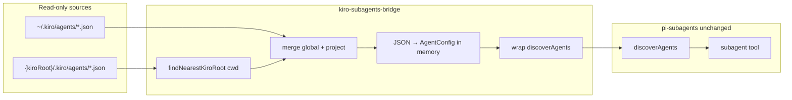

# Pi extension: Kiro agents → pi-subagents bridge

## Context

**Problem:** [pi-subagents](https://github.com/nicobailon/pi-subagents) discovers subagents only from fixed paths and **Markdown + YAML frontmatter** — not Kiro JSON:

| Scope | Paths |
|-------|--------|
| Builtin | package `agents/*.md` |
| User | `~/.pi/agent/agents`, `~/.agents` |
| Project | `{projectRoot}/.pi/agents/**/*.md`, legacy `{projectRoot}/.agents/**/*.md` |

`findNearestProjectRoot()` walks up until **`.pi` or `.agents`** exists — it does **not** treat `.kiro` as a project marker. There is **no** `subagents.extraAgentDirs` (or similar) in settings today.

**Company reality:** Agents are authored in **Kiro CLI format** (`*.json`):

- `~/.kiro/agents/` (after Kiro `install.sh`, e.g. `api-gateway-dev`)
- `{repo}/.kiro/agents/` (e.g. `foodtech/.../web-apps/.kiro/agents/ecom-fe-dev.json`)

Repos may have **only** `.kiro` (no `.pi`). We must **not** create or require `.pi/` in those repos.

**Goal:** Small local Pi extension in dotfiles that keeps pi-subagents unchanged and **also** exposes Kiro agents as `kiro.<name>` subagents when relevant.

**Existing:** `pi/.pi/agent/extensions/kiro-acp/` — model provider only; orthogonal.

---

## Hard constraints (from review)

| Rule | Detail |
|------|--------|
| **No repo writes** | Never create `.pi/`, `.pi/agents/`, or `.kiro-sync/` inside git repos |
| **Silent for repos** | Only read `{repo}/.kiro/agents/*.json`; zero generated files in the tree |
| **Home-only artifacts** | Any generated files live under `~/.pi/agent/kiro-agents/` only (if needed) |
| **Prefer no files** | In-memory discovery first; disk cache only as fallback |

---

## Approach (two tiers)

### Tier 1 — Runtime discovery (preferred)

Wrap pi-subagents `discoverAgents()` so Kiro JSON is parsed **in memory** into `AgentConfig` and merged at list time. No markdown files anywhere.



**How wrapping works:**

1. Bridge extension loads **before** `npm:pi-subagents` (add as a `packages` entry above `pi-subagents` in `settings.json`).
2. On init, import `discoverAgents` from the installed pi-subagents module and replace it with `discoverAgentsWithKiro(cwd, scope)` that:
   - calls the original function;
   - loads Kiro agents for the current `cwd`;
   - merges with pi-subagents precedence: **builtin < user < project < kiro-global < kiro-project** (project Kiro wins over global Kiro on same `name`).
3. Kiro project root = walk up from `cwd` until directory contains **`.kiro`** (ignore whether `.pi` exists).

**Why this is feasible:** `AgentConfig` is a plain interface (`agents.ts`); conversion from Kiro JSON does not require `.md` on disk. `filePath` can point at the source JSON for debugging.

**Load-order risk:** pi-subagents captures `discoverAgents` when its extension starts. The bridge must patch the module export **before** that. Validate in implementation; if patching fails (frozen ESM exports), use Tier 2.

### Tier 2 — Home active slot (fallback only)

If runtime wrap is not reliable:

1. On `session_start`, compute merged Kiro agents for **current `cwd` only** (not all repos on disk).
2. Write markdown only to `~/.pi/agent/kiro-agents/active/` (wipe + rewrite each session).
3. pi-subagents already scans `~/.pi/agent/agents` **recursively** — symlink or configure so `active/` is visible:
   - **Option A:** `~/.pi/agent/agents/kiro-active` → symlink to `../kiro-agents/active` (one-time home setup by bridge on first run).
   - **Option B:** write directly into `~/.pi/agent/agents/kiro-active/` (still home-only).

Optional content-addressed cache: `~/.pi/agent/kiro-agents/cache/<hash>/` to skip re-resolving large `resources` globs; **never** commit, never touch repos.

**Not viable:** `subagents.extraAgentDirs` in settings — field does not exist upstream; would require a pi-subagents fork (out of scope).

---

## Decisions (confirmed)

| Topic | Choice |
|-------|--------|
| Runtime name | `kiro.<localName>` via `package: kiro` |
| Precedence | `{kiroRoot}/.kiro/agents` overrides `~/.kiro/agents` on same `name` |
| Global Kiro | Always include `~/.kiro/agents/` (any cwd) |
| Standalone `agents/` | Out of scope — user uses Kiro `install.sh` → `~/.kiro/agents/` |
| Models | `mapKiroModel()`: bare id → `kiro-acp/<id>` when in kiro-acp model list |
| Repo `.pi` | **Never** created by this extension |

---

## Kiro → Pi mapping (in memory or home `.md`)

| Kiro JSON | Pi agent |
|-----------|----------|
| `name` | `localName`; runtime `kiro.<name>` |
| `description` | `description` |
| `model` | after `mapKiroModel()` |
| `prompt` (`file://…`) | `systemPrompt` body (resolve paths relative to JSON dir / kiro root) |
| `resources[]` | inlined appendix and/or `defaultReads` (capped) |
| `tools[]` | best-effort builtin list; warn on `@namespace/*` |
| `mcpServers` | warn only in phase 1 |

Defaults: `systemPromptMode: replace`, `inheritProjectContext: true`, `inheritSkills: false`, `package: kiro`.

### Model mapper (`model-map.ts`)

- Already `provider/id` → unchanged.
- Else if id in `kiro-acp/models.ts` → `kiro-acp/<id>`.
- Else pass through.

---

## Discovery merge algorithm

```
global = readKiroJsonDir(~/.kiro/agents)
kiroRoot = findNearestKiroRoot(cwd)   // first ancestor with .kiro/
project = kiroRoot ? readKiroJsonDir(kiroRoot/.kiro/agents) : {}
merged = { ...global, ...project }    // project wins
agents = merged.map(toAgentConfig)
return originalDiscoverAgents(cwd, scope) merged with agents
```

**Important:** Repos with only `.kiro` (no `.pi`) still get project Kiro agents via `kiroRoot`, without making pi-subagents treat the repo as a Pi project.

---

## Files to modify / create

| Path | Action |
|------|--------|
| `pi/.pi/agent/extensions/kiro-subagents-bridge/index.ts` | Init: patch `discoverAgents` or `session_start` sync |
| `pi/.pi/agent/extensions/kiro-subagents-bridge/discover.ts` | `findNearestKiroRoot`, merge, wrap |
| `pi/.pi/agent/extensions/kiro-subagents-bridge/kiro-parse.ts` | Parse Kiro JSON |
| `pi/.pi/agent/extensions/kiro-subagents-bridge/map-to-pi.ts` | `AgentConfig` builder |
| `pi/.pi/agent/extensions/kiro-subagents-bridge/model-map.ts` | Model id mapping |
| `pi/.pi/agent/extensions/kiro-subagents-bridge/sync.ts` | Tier 2 home `active/` writer (fallback) |
| `pi/.pi/agent/settings.json` | Register bridge package **before** `pi-subagents` |

No `.gitignore` in company repos for this feature.

---

## Reuse

| What | Where |
|------|--------|
| `AgentConfig`, `discoverAgents` | `pi-subagents/src/agents/agents.ts` |
| Pi extension lifecycle | `pi/.pi/agent/extensions/kiro-acp/index.ts` |
| Kiro `file://` resolution | `api-gateway-dev/install.sh` |
| Samples | `web-apps/.kiro/agents/*.json`, `~/.kiro/agents/` after install |

---

## Steps

- [x] Scaffold `kiro-subagents-bridge` extension
- [x] Register in `settings.json` (`+extensions/kiro-subagents-bridge/index.ts`)
- [x] Implement `findNearestKiroRoot` (`.kiro` only, excludes `~/.kiro`)
- [x] Implement Kiro JSON → markdown conversion + `mapKiroModel`
- [x] **Tier 1:** wrap `discoverAgents` — cancelled; Tier 2 sufficient; MCP agents skip `kiro-acp` model
- [x] **Tier 2:** home `~/.pi/agent/agents/kiro-active/` (content-hashed writes)
- [x] Resolve `file://` paths; cap `resources` glob expansion; skip `skill://`
- [x] Log sync summary on `session_start` (`PI_KIRO_BRIDGE_DEBUG=1` for verbose)
- [x] Manual test: `web-apps` (`.kiro` only); global via `~/.kiro/agents/` after `install.sh`

---

## Verification

1. **`web-apps`** (has `.kiro/agents/`, must **not** gain `.pi/` after running Pi):
   - `subagent` list includes `kiro.ecom-fe-dev`
   - `git status` in repo unchanged by bridge
2. **Any cwd** after global install to `~/.kiro/agents/`:
   - `kiro.api-gateway-dev` visible
3. **Precedence:** same `name` in project `.kiro/agents` overrides `~/.kiro/agents`
4. **Model:** Kiro `claude-sonnet-4.6` runs as `kiro-acp/claude-sonnet-4.6` when mapped

---

## Risks / limitations

1. **Extension load order** — Tier 1 depends on patching before pi-subagents binds `discoverAgents`; document fallback.
2. **Kiro MCP tools** (`@foodtech-gitlab/*`) need Pi MCP parity; phase 1 = prompt + resources.
3. **Large `resources` globs** — byte/file caps required.
4. **Tier 2 leakage** — if using home `active/`, only refresh for current `cwd` so other projects’ agents do not appear globally.

---

## Out of scope

- Creating `.pi/` or any files under company git repos
- Scanning `{repo}/agents/*.json` without `.kiro`
- Forking pi-subagents (upstream `extraAgentDirs` is a future nice-to-have)
- Auto-provisioning Pi MCP from Kiro `mcpServers`
